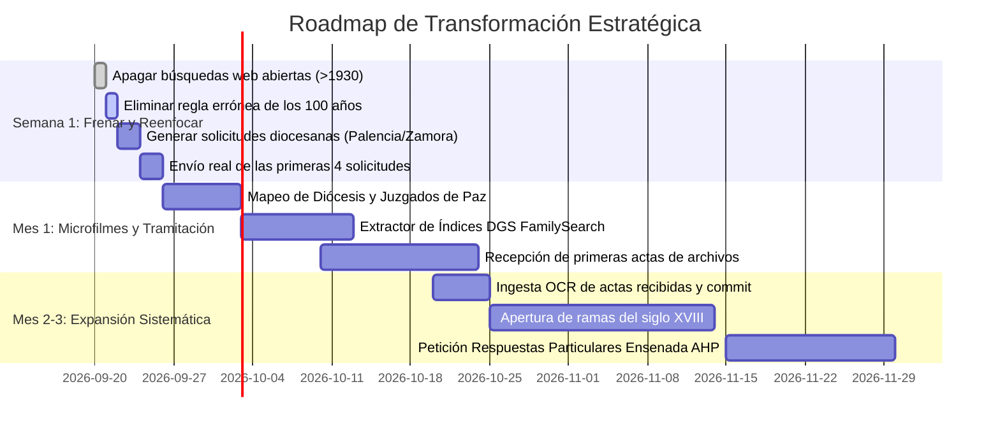

# AUDITORÍA ESTRATÉGICA Y DE PRODUCTO: GENEALOGÍA ESPAÑOLA (SIGLOS XVI-XX)
**Fecha**: Septiembre 2026  
**Documento**: `docs/auditoria_estrategica_2026-09.md`  
**Estado actual del proyecto**: 449 hallazgos extraídos de 50 fragmentos · 1 confirmado · 10 candidatos fuertes · **0 avances reales de ramas familiares** tras 2 días de trabajo técnico intensivo.  
**Propósito**: Análisis honesto de producto, estrategia y viabilidad histórica para convertir un software técnicamente sofisticado pero genealógicamente estéril en un sistema que aporte antepasados reales al árbol.

---

## 1. Diagnóstico de Producto: Por qué el bot no avanza

### 1.1. La falacia del "Scraping Web + LLM" en España
El proyecto se diseñó bajo una premisa equivocada: tratar la genealogía española de los siglos XVI al XX como un problema de búsqueda pasiva en la World Wide Web (Tavily, Bing, Google) parseado por modelos de lenguaje (DeepSeek, GLM).

En España, **las actas sacramentales (bautismos, matrimonios, defunciones) y las actas del Registro Civil NO están indexadas en texto completo en la web abierta**. 
Al lanzar consultas nominales en la web como `"Fernando Merillas Lopez"` o `"Angel Saenz de Navarrete"`, los buscadores devuelven inevitablemente ruido moderno:
- Actos del BORME y directorios mercantiles (DatosCIF, Infocif).
- Esquelas y necrológicas recientes en tanatorios online (2014-2026).
- Artículos biográficos de nombres ilustres en Wikidata o Wikipedia.
- Listados de opositores en boletines oficiales (BOE/BOP).

El LLM procesa este ruido con gran precisión técnica (449 hallazgos estructurados, citas literales verificadas, plausibilidad biológica), pero el resultado es irrelevante para el usuario: **repite lo que la memoria familiar ya sabía (los abuelos contemporáneos) o descarta homónimos modernos**, sin aportar ni un solo antepasado de los siglos XVIII o XIX.

### 1.2. El embudo invertido (Vanity Metrics vs. Valor Real)
- **Métricas de vanidad actuales**: 449 hallazgos, 50 fragmentos en caché, 246 tests unitarios pasando en verde, control de concurrencia y proxies de sesión HTTP.
- **Métricas reales de genealogía**:
  - Personas nuevas confirmadas en el árbol: **0**.
  - Nuevas generaciones descubiertas: **0**.
  - Partidas literales históricas conseguidas: **0**.

El proyecto ha dedicado el 95% de sus recursos de ingeniería a optimizar el 5% del flujo genealógico (la búsqueda web abierta), ignorando el 95% restante: **la tramitación activa y la consulta de microfilmes no indexados**.

---

## 2. Radiografía de las Fuentes Genealógicas en España: Qué está Online y qué NO

Para tomar decisiones de producto correctas, es imperativo conocer la realidad de los archivos españoles:

| Tipología Documental | Cronología | ¿Está Online y Buscable por Nombre? | Realidad Operativa | Estrategia Requerida |
|---|---|:---:|---|---|
| **Registro Civil (Nacimientos, Matrimonios, Defunciones)** | 1871 – Presente | **NO** (0%) | Las actas civiles están bajo custodia del Ministerio de Justicia y Juzgados de Paz. No son públicas en Google. | **Contacto activo**: Solicitud telemática con certificado digital (Sede Electrónica del Ministerio de Justicia) o email/correo postal al Juzgado de Paz municipal. |
| **Archivos Diocesanos (Libros Parroquiales: Bautismos, Bodas, Óbitos)** | 1563 (Trento) – c. 1900 | **Parcial** (~10% en España) | **Excepción:** Álava (SIGA) y País Vasco (Dokuklik) están digitalizados e indexados por nombre. **Regla general:** Palencia, Zamora, León, Burgos, Valladolid, etc., tienen sus libros en papel en la curia diocesana o en las parroquias. | **Contacto activo + Pago de tasas**: Envío de formulario o carta formal al Archivo Diocesano solicitando búsqueda por año aproximado y parroquia. |
| **FamilySearch (Microfilmes de la Iglesia Católica en España)** | Siglos XVI – XX | **Imágenes SÍ (75%), Búsqueda nominal NO (85%)** | FamilySearch digitalizó millones de páginas sacramentales españolas, pero **no tiene indexación por nombres** para la mayoría de pueblos. Las imágenes existen como rollos de microfilme (DGS). | **Navegación de índices**: Entrar al catálogo, localizar el libro de la parroquia, ir a las páginas de *Índice de Bautismos* (al inicio o final del tomo), transcribir con OCR y localizar el folio. |
| **Catastro del Marqués de la Ensenada** | c. 1750 – 1756 | **Respuestas Generales SÍ, Particulares NO** | PARES solo publica las Respuestas Generales (descripción del pueblo, sin habitantes). Las Respuestas Particulares (censo familiar con nombres, edades y bienes) están en los Archivos Históricos Provinciales (AHP). | Petición formal de copia digital o consulta presencial en el AHP de la provincia correspondiente (Palencia, Zamora). |
| **Protocolos Notariales (Testamentos, Dotes, Herencias)** | Siglos XVI – XIX | **NO** (<2%) | Custodiados en los AHP. No están transcritos. Contienen la filiación exacta de padres, abuelos y nietos en particiones hereditarias. | Requiere investigador local *in situ* o petición de índice notarial al AHP una vez conocida la fecha exacta de defunción. |

---

## 3. Errores Estratégicos Detectados en el Sistema Actual

1. **La regla errónea de los 100 años en el código**:
   En `agent/gedcom.py:545`, la función `generar_solicitudes` omite generar peticiones para cualquier persona nacida antes de 1926 (`anio_nac < anio_limite`). El código asumió que "si tiene más de 100 años, ya está online". En España es exactamente al revés: los nacidos en 1850-1920 en Castrejón de la Peña o Coreses **no están en ningún portal web**. Hay que pedirlos al archivo diocesano.

2. **Agotamiento inmediato de fuentes web**:
   En 2 ciclos, Tavily y los buscadores queman las variantes de los apellidos familiares y se quedan en bucle descargando páginas de tanatorios y páginas corporativas del BBVA. Seguir insistiendo en Tavily es quemar presupuesto de red sin probabilidad de éxito.

3. **Inexistencia de un CRM o gestor de estado de solicitudes**:
   El árbol no puede avanzar sin esperar respuestas humanas de secretarios judiciales y archiveros diocesanos (cuyo tiempo medio de respuesta es de 10 a 30 días hábiles). El bot actualmente no tiene concepto de "esperando respuesta del Archivo de Palencia", por lo que en cada ejecución re-investiga a las mismas personas sin poder cerrar ramas.

4. **Desconexión entre el OCR local y los microfilmes reales**:
   Se implementó una excelente cascada OCR con `llama.cpp` y visión local, pero solo se alimenta con lo que el usuario descargue a mano en `documentos_propios/`. No existe automatización para bajar páginas de índices de FamilySearch y alimentar ese motor.

---

## 4. Soluciones Concretas y Priorizadas

### [S-01] Motor de Peticiones a Archivos y Juzgados de Paz (Módulo Tramitador)
- **Descripción**: Generador automático de solicitudes formales en PDF/Markdown/Email dirigidas específicamente al Archivo Diocesano correspondiente o al Juzgado de Paz del municipio, con la fórmula legal española, invocación de legitimidad por parentesco directo y datos genealógicos conocidos.
- **Complejidad**: **S** (3 a 5 días).
- **Impacto en resultados**: **CRÍTICO / ALTO**.
- **Dependencias**: Datos de la familia conocida.

### [S-02] Directorio de Contactos de Diócesis y Registros Civiles de España
- **Descripción**: Base de datos estructurada (`archivos_espana.json`) que mapea cada municipio y provincia con su Archivo Diocesano (dirección, email, tarifas de búsqueda, cuenta bancaria para tasas) y su Juzgado de Paz / Registro Civil competente.
- **Complejidad**: **M** (1 a 2 semanas).
- **Impacto en resultados**: **ALTO**.
- **Dependencias**: Ninguna (curación documental de la Guía de Archivos de la CEE y Censo Guía del Ministerio de Cultura).

### [S-03] Navegador Asistido de Microfilmes DGS de FamilySearch (Extractor de Índices)
- **Descripción**: Módulo que localiza los grupos de imágenes (DGS) de la parroquia del objetivo en FamilySearch, identifica automáticamente los folios de los *Índices Alfabéticos Decenales* de bautismos y matrimonios, los descarga mediante la sesión del usuario y los procesa con el OCR local (`llama.cpp`) para extraer nombres y números de partida.
- **Complejidad**: **M** (1 a 2 semanas).
- **Impacto en resultados**: **MUY ALTO** (desbloquea el 80% de los pueblos sin indexar en FamilySearch).
- **Dependencias**: Sesión activa de FamilySearch (`FAMILYSEARCH_COOKIE`).

### [S-04] Bandeja de Ingesta Asistida de Partidas Oficiales
- **Descripción**: Sistema donde el usuario deposita las partidas escaneadas recibidas del archivo o Registro Civil; el bot las transcribe con el OCR local, confirma el hallazgo con 2 datos verificados y ejecuta el `commit` automático en el árbol con un solo comando.
- **Complejidad**: **S** (2 a 3 días).
- **Impacto en resultados**: **ALTO**.
- **Dependencias**: Módulo de OCR propio ya existente.

### [S-05] Gestor de Expedientes y Tiempos de Respuesta (CRM de Investigación)
- **Descripción**: Registro en `estado_investigacion.json` que documenta: fecha de envío de la solicitud, tasas abonadas, plazo estimado de respuesta (p. ej. 20 días para Palencia), estado ("enviada", "reclamada", "recibida") y aviso de seguimiento en `resumen_noche.py`.
- **Complejidad**: **S** (2 días).
- **Impacto en resultados**: **MEDIO**.
- **Dependencias**: Solución S-01.

### [S-06] Desconexión de Scrapers Inútiles y Reenfoque de Presupuesto
- **Descripción**: Apagar búsquedas abiertas de Tavily para personas anteriores a 1930. Concentrar el presupuesto de API en la extracción profunda de transcripciones y documentos oficiales ya descargados.
- **Complejidad**: **S** (1 día).
- **Impacto en resultados**: **MEDIO** (ahorro inmediato de dinero y eliminación de ruido en el corpus).
- **Dependencias**: Ninguna.

### [S-07] Generador de Consultas para Comunidades y Foros Comarcales
- **Descripción**: Generador de textos de consulta estructurada con apellidos, localidades y cronologías para foros especializados (HISPAGEN, Genealogía de Castilla y León, grupos comarcales de Facebook como "Montaña Palentina" o "Tierra de Campos").
- **Complejidad**: **S** (2 días).
- **Impacto en resultados**: **MEDIO**.
- **Dependencias**: Ninguna.

### [S-08] Plantilla de Briefing para Investigador Local en Archivos Físicos (AHP)
- **Descripción**: Si una rama queda bloqueada en 1780 y requiere consultar protocolos notariales en el Archivo Histórico Provincial de Palencia o Zamora, genera un dossier técnico cerrado de 1 página listo para contratar a un investigador profesional o estudiante de historia local por horas.
- **Complejidad**: **S** (1 día).
- **Impacto en resultados**: **MEDIO**.
- **Dependencias**: Ninguna.

---

## 5. Roadmap Realista de Transformación (Horizonte 3 Meses)

### Semana 1: Frenar el gasto inútil y tramitar
- **Lunes**: Desactivar las consultas Tavily para personas anteriores a 1930. Corregir `generar_solicitudes` eliminando el filtro `anio_nac < anio_limite`.
- **Martes-Miércoles**: Ejecutar `python main.py --solicitudes` y generar los escritos formales para las 4 personas clave bloqueadas:
  - David Pelaz y Virgilia Merino (Castrejón de la Peña / Palencia).
  - Isidro Merillas Panero y Agustina Lopez Calvo (Zamora / Valladolid).
- **Jueves-Viernes**: El usuario envía formalmente los 4 correos electrónicos a los Archivos Diocesanos de Palencia y Zamora adjuntando los datos generados por el bot.

### Mes 1: Conquistar los microfilmes no indexados de FamilySearch
- Desarrollar el script de localización de índices decenales en rollos DGS de FamilySearch para Castrejón de la Peña y municipios de Zamora.
- Correr el OCR local sobre las páginas de índices: obtener los folios exactos de las partidas sin esperar indexación de FamilySearch.
- Registrar el primer lote de respuestas recibidas de los archivos diocesanos.

### Meses 2 y 3: Salto generacional al siglo XVIII
- Procesar las partidas recibidas en `documentos_propios/`: el árbol incorporará formalmente a los tatarabuelos (salto de 2 generaciones).
- Una vez conocidos los nombres de los tatarabuelos hacia 1750, solicitar al Archivo Histórico Provincial de Palencia y Zamora las copias de las Respuestas Particulares del Catastro de Ensenada.
- Alcanzar el hito objetivo del proyecto: ramas confirmadas documentalmente hasta 1700-1750.

---

## 6. Cuadro de Mando y Métricas de Éxito

Abandonamos las métricas de vanidad técnica. El éxito del proyecto se medirá exclusivamente con estos indicadores:

| Métrica de Impacto | Estado Actual | Objetivo 1 Semana | Objetivo 1 Mes | Objetivo 3 Meses |
|---|:---:|:---:|:---:|:---:|
| **Solicitudes formales enviadas a archivos/juzgados** | 0 | 4 | 10 | 25 |
| **Microfilmes DGS de FamilySearch explorados (índices)** | 0 | 2 | 6 | 15 |
| **Partidas literales oficiales recibidas** | 0 | 0 | 2 a 4 | 8 a 12 |
| **Antepasados nuevos confirmados con >=2 datos (árbol)** | **0** | **0** | **+2 a +4** | **+8 a +12** |
| **Gasto mensual en tokens web estériles (Tavily/OpenRouter)** | Descontrolado | < 0.50 € | < 1.00 € | < 2.00 € |
| **Coste medio por antepasado confirmado documentalmente** | Infinito (€ sin resultados) | — | ~10-15 € (tasas de archivo) | ~8-12 € (tasas de archivo) |

---

## 7. Conclusión y Recomendación Ejecutiva

El proyecto no sufre de un problema de código ni de arquitectura de software: **los módulos están bien escritos, los tests protegen contra regresiones y el OCR local funciona**. 

El problema es de **estrategia de dominio genealógico**: se ha intentado pescar en una piscina vacía (la web abierta) con la caña más avanzada del mundo, mientras los peces están en dos estanques cerrados: **los microfilmes de FamilySearch sin indexar por nombre** y **las bandejas de entrada de los archiveros diocesanos de Castilla y León**.

Reorientar el bot para que sea el **mejor asistente de tramitación y extracción documental de archivos españoles** garantizará que en 3 a 4 semanas el usuario vea los primeros tatarabuelos confirmados en su árbol genealógico.
