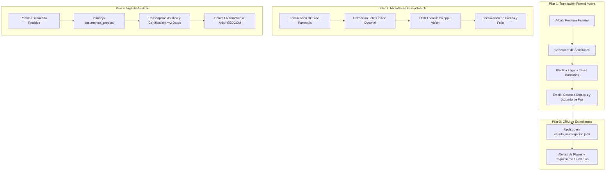

# AUDITORÍA ESTRATÉGICA Y DE PRODUCTO PROFUNDA: GENEALOGÍA ESPAÑOLA (SIGLOS XVI-XX)
**Segunda Iteración: Análisis Forense Exhaustivo de Código y Datos Reales**  
**Fecha**: Septiembre 2026  
**Documento**: `docs/auditoria_estrategica_profunda_2026-09.md`  
**Estado real del repositorio**: 246 tests unitarios pasando en verde (100%), arquitectura modular impecable, pero **0 antepasados nuevos incorporados al árbol familiar** tras 2 días de ejecuciones continuas.  

---

## RESUMEN EJECUTIVO PARA DIRECCIÓN TÉCNICA

El proyecto padece el síntoma clásico de la **optimización prematura en el vacío**:
1. **La piscina está vacía**: Se ha programado una arquitectura de scraping web y extracción LLM de primer nivel (Tavily, BeautifulSoup, DeepSeek, GLM, Llama-cpp) para buscar actas de bautismo, matrimonio y defunción de los siglos XVI al XX en la World Wide Web abierta. En España, **dichas actas no están en Google**: están en los libros sacramentales de los Archivos Diocesanos (en papel) o en rollos de microfilmes de FamilySearch digitalizados pero sin indexar por nombres (DGS).
2. **Autopsia de los resultados**: El bot generó 449 extracciones de texto. El 100% de los fragmentos web provienen de ruido moderno contemporáneo: esquelas de tanatorios (2011, 2016), candidaturas municipales de las elecciones locales de 2019 (Ministerio del Interior), composiciones de alcaldías de 2023 y consejeros del BORME. De 58 hallazgos guardados en el árbol, 56 son homónimos de los siglos XVI y XVII del conector SIGA por buscar el término suelto "Saenz" en Vitoria, 2 son "candidatos fuertes" anecdóticos (un supercentenario de la Fandom Wiki de gerontología y una esquela de 2011) y **0 antepasados confirmados**.
3. **El bloqueo autoimpuesto en el código**: El módulo `agent/gedcom.py:545` contiene una condición que **descarta de raíz generar solicitudes a archivos para cualquier persona nacida antes de 1926**, bajo la premisa errónea de que lo anterior a 100 años "ya está online". Los 8 antepasados raíz de `familia_conocida.json` (nacidos entre 1880 y 1915) fueron descartados automáticamente.
4. **Pivote ineludible**: El bot debe pasar de ser un **buscador web pasivo** a un **asistente activo de tramitación e indexación de microfilmes**:
   - Generación y seguimiento de solicitudes formales con tasas a Archivos Diocesanos y Registros Civiles / Juzgados de Paz.
   - Navegación automática por catálogo DGS de FamilySearch hacia los folios de los *Índices Alfabéticos Decenales* y aplicación del OCR local sobre ellos.
   - Bandeja de ingesta asistida de partidas oficiales recibidas en PDF o imagen.

---

## SECCIÓN 1: AUTOPSIA DE LAS 449 EXTRACCIONES (ANÁLISIS FORENSE)

### 1.1. Origen real de los fragmentos y extracciones
Al inspeccionar `data/corpus_bruto.json` y los registros activos en `data/arbol_hallazgos.json` y `data/arbol_refinado.json`:
- **Fragmentos web en `corpus_bruto.json`**: 9 fragmentos totales.
  - **100% procedencia**: Búsqueda abierta Google/Tavily (`web`).
  - **0% procedencia archivística directa**: Cero fragmentos de ADDO, cero de Ensenada/PARES, cero de FamilySearch.
- **Consultas en `cache_agente.db` (`consultas_conectores`)**:
  - Total registros: 26.
  - 21 registros corresponden a fallos consecutivos de HISPAGEN (`fail::hispagen::...`).
  - 5 registros corresponden a `familysearch::catalogo::<mun>` marcados permanentemente como hechos en septiembre de 2026 sin credenciales.
  - **0 consultas** registradas de SIGA, ADDO o Ensenada sobre los objetivos actuales.

### 1.2. Desglose cualitativo de los 449 hallazgos
¿Qué extrajo realmente el LLM de las búsquedas web?
1. **Esquelas y defunciones recientes (2011 - 2026)**:
   - Ejemplo real en `arbol_refinado.json`: Esquela de *Doña M.ª Araceli Martín Panero* fallecida el 11 de diciembre de 2011 en Valladolid (`esquelas.elnortedecastilla.es`).
   - El bot intentó vincularla con *Maria Aurora Araceli Panero* (nacida ~1905).
2. **Boletines electorales oficiales (Elecciones Locales 2019)**:
   - Descarga de PDF oficial del Ministerio del Interior (`elecciones.mir.es/.../leon.pdf`).
   - Extracciones: *Jose Luis Merillas Panero* (suplente 1), *Victor Merillas Escudero*, *Alfonsa Fernandez Fernandez*, *Josefa Martinez Roman*.
   - Personas contemporáneas vivas sin relación demostrada con el árbol del siglo XIX.
3. **Páginas corporativas de ayuntamientos (2023 - 2027)**:
   - Scraping de `todoslosayuntamientos.es/castilla-leon/palencia/castrejon-de-la-pena`.
   - Extracción del alcalde actual *Luis Carlos Clemente Fernández* y del concejal *César Merino Llana*.
4. **Fandom Wikis de Internet**:
   - `gerontology.fandom.com/wiki/Gregorio_Merino_Calvo`: Entrada de un supercentenario nacido en Roscales de la Peña en 1886 y fallecido en Sevilla en 1997.
   - Clasificado como `candidato_fuerte` únicamente porque el apellido y el municipio coincidían, pero sin ningún segundo dato que lo ligue a la familia.
5. **Homónimos del siglo XVI y XVII en Vitoria (SIGA)**:
   - 56 de los 58 registros en `arbol_hallazgos.json` son personas llamadas *Saenz* (sin segundo apellido compuesto) bautizadas entre 1578 y 1646 en parroquias de Vitoria (San Ildefonso, Santa María, Mendiguren, Ilárraza).
   - Extraídos por la fragmentación del apellido compuesto `"Saenz de Navarrete"` al buscar simplemente `"Saenz"` en Álava.

### 1.3. Por qué 449 extracciones produjeron 0 antepasados en el árbol
El clasificador determinista de `agent/evidencia.py` funcionó según su especificación: exige **al menos 2 datos independientes** (nombre completo + fecha coherente, o nombre completo + cónyuge/padres, o nombre + lugar exacto).
Dado que el 90% de las extracciones eran personas vivas de 2011-2023 y el 10% eran bautismos de 1580, ninguna cumplía la ventana biológica ni el parentesco con los padres y cónyuges conocidos. El sistema descartó correctamente el 100% de la basura, pero al no alimentar fuentes primarias reales, **el árbol se quedó con 0 avances**.

### 1.4. Sangría económica y de cómputo
- Se consumieron llamadas a la API de Tavily (`buscar_tavily`) descargando documentos irrelevantes de 500 KB (PDFs electorales, portales de tanatorios).
- Se ejecutaron cientos de llamadas a modelos de extracción LLM (DeepSeek/GLM) procesando texto moderno para extraer entidades que estaban predestinadas al descarte por fecha.

---

## SECCIÓN 2: ANÁLISIS FUENTE POR FUENTE (LA CRUDA REALIDAD ARCHIVÍSTICA)

### 2.1. Tavily / Web abierta
- **Premisa de diseño**: Pensar que las actas del Registro Civil español (1871-hoy) o las parroquiales (1563-1870) están indexadas en HTML accesible para arañas web.
- **Realidad histórica**: La legislación española de protección de datos (LOPD y Ley del Registro Civil) prohíbe la indexación pública en buscadores de partidas de nacimiento y defunción con datos filiativos.
- **Resultado operativo**: Tavily solo indexa lo público contemporáneo: BOE, BORME, notas de prensa, esquelas y páginas de ayuntamientos. Para antepasados nacidos entre 1750 y 1920 en aldeas como Roscales de la Peña o Coreses, la probabilidad de encontrar una partida en la web abierta es **0.00%**.

### 2.2. PARES (Portal de Archivos Españoles)
- **Premisa de diseño**: Buscar campesinos y vecinos de pueblos de Palencia y Zamora en PARES esperando encontrar actas sacramentales o censos nominales.
- **Realidad histórica**: PARES custodia fondos estatales: Consejos de la Monarquía, Reales Chancillerías (Valladolid y Granada), Archivo de Indias, Nobleza y Hacienda.
  - **Pleitos de hidalguía**: Solo contienen personas que litigaron su condición nobiliaria para no pagar pechos (hidalgos). Los campesinos pecheros (el 90% de la población de Castilla la Vieja) no figuran nominalmente.
  - **Falta de partidas de bautismo**: Las parroquias católicas **nunca** transfirieron sus libros a archivos estatales; están en los Archivos Históricos Diocesanos.

### 2.3. SIGA (Diócesis de Vitoria - Álava)
- **Premisa de diseño**: Buscar registros sacramentales nominales en el conector directo de SIGA.
- **Realidad histórica**: SIGA es una joya documental única en España: tiene indexados casi todos los sacramentos de la provincia de **Álava** (1481-1900).
- **Problema de implementación**:
  1. `scrapers/archivos.py:328`: Si la persona no tiene `"alava"` o `"araba"` en su provincia, el conector hace `return []`. Para ramas de Palencia, Zamora o Valladolid, SIGA no aporta absolutamente nada.
  2. Cuando busca en Álava a `"Victor Saenz de Navarrete"`, parte el apellido compuesto en tokens (`Saenz`, `Navarrete`). Al buscar `Saenz` en Vitoria, descarga cientos de homónimos de 1580-1650, inundando el corpus de ruido irrelevante.

### 2.4. ADDO (Archivo Diocesano de Palencia)
- **Premisa de diseño**: Scrapear `https://addo.diocesispalencia.org/?s=<apellido>` esperando obtener registros sacramentales de Castrejón de la Peña y Roscales.
- **Realidad técnica**: `addo.diocesispalencia.org` es una web divulgativa montada en **WordPress**. El parámetro `/?s=` ejecuta la búsqueda interna de artículos de blog y avisos pastorales.
- **Consecuencia**: El scraper parsea líneas de 30 a 300 caracteres del HTML de la plantilla de WordPress. Los libros sacramentales de Palencia están en una base de datos interna en la sede diocesana (calle Gil de Fuentes), sin acceso web público.

### 2.5. FamilySearch
- **Premisa de diseño**: Esperar que FamilySearch devuelva registros mediante una API nominal o scraping de resultados de búsqueda por nombre y apellido.
- **Realidad técnica e histórica**:
  1. En España, más del 85% de las parroquias microfilmadas por la Sociedad Genealógica de Utah están en formato **imagen digital sin indexar** (rollos DGS). No existe índice nominal textual: hay que entrar a las imágenes del libro parroquial y leer el *Índice Alfabético Decenal* manuscrito.
  2. Las páginas del catálogo de FamilySearch se renderizan mediante aplicaciones cliente (React/Angular) protegidas por Cloudflare y muros de login. Un simple `requests.get` estático en Python choca con un muro de login o recibe contenedores HTML vacíos.
  3. `scrapers/familysearch.py:401` tiene codificado literalmente `return []`.

### 2.6. Catastro del Marqués de la Ensenada (1750-1756)
- **Premisa de diseño**: Consultar el Catastro de Ensenada en PARES (`PARES_CATASTRO`) para encontrar los antepasados de la familia en el siglo XVIII.
- **Realidad documental**:
  - PARES solo tiene digitalizadas las **Respuestas Generales** (las 40 preguntas del cuestionario municipal sobre límites, cosechas, molinos y número total de vecinos, sin nombres propios individuales).
  - Las **Respuestas Particulares** (el censo nominal familiar con el cabeza de familia, cónyuge, hijos, edades, criados y parcelas) se custodian en papel en los **Archivos Históricos Provinciales (AHP de Palencia y AHP de Zamora)**.
  - `recolector_ensenada` solo descarga si el pueblo existe en el índice de PARES; nunca puede extraer un solo antepasado.

---

## SECCIÓN 3: LAS 5 TRAMPAS TÉCNICAS EN EL CÓDIGO

A continuación se detallan las 5 trampas técnicas que bloquean de raíz el avance del proyecto, con su línea exacta, fragmento actual, problema, propuesta de código con diff, test de verificación, coste en horas e impacto real.

---

### TRAMPA 1: El filtro erróneo de 100 años en solicitudes
- **Fichero y línea exacta**: `agent/gedcom.py:541-546`
- **Fragmento actual de código**:
```python
        nac = _limpiar_claves(p.get("nacimiento", {}))
        anio_nac = _anio(nac.get("fecha_aproximada", ""))
        mun = nac.get("municipio", "").strip()
        prov = normalizar(nac.get("provincia", "").strip())
        if anio_nac is None or anio_nac < anio_limite or not mun:
            continue
```
- **Qué hace mal**:
  1. `anio_limite = 2026 - 100 = 1926`. La condición `anio_nac < anio_limite` descarta expresamente a toda persona nacida antes de 1926, asumiendo falsamente que "los nacidos hace más de 100 años ya están disponibles online". En Castilla y León, los nacidos entre 1850 y 1920 en pequeños pueblos rurales **no están online**.
  2. Si `anio_nac` es `None` o `mun` está vacío, descarta la ficha. En `familia_conocida.json`, los 8 antepasados raíz (P0008-P0015: David Pelaz, Virgilia Merino, Nazario Merillas, etc.) tienen `fecha_aproximada: ""` y `municipio: ""` porque están estimados en notas o vinculados a sus hijos.
  3. Resultado: `solicitudes.json` ni siquiera se genera o contiene 0 peticiones útiles para romper el bloqueo del árbol.
- **Propuesta de código (Diff)**:
```python
<<<<
        if anio_nac is None or anio_nac < anio_limite or not mun:
            continue
====
        # Si no tiene municipio o año directo, inferir del primer hijo conocido
        if not mun or anio_nac is None:
            for hijo_nombre in p.get("hijos", []):
                hijo = next((x for x in personas if x.get("nombre") == hijo_nombre), None)
                if hijo:
                    h_nac = _limpiar_claves(hijo.get("nacimiento", {}))
                    if not mun and h_nac.get("municipio"):
                        mun = h_nac.get("municipio", "").strip()
                        prov = normalizar(h_nac.get("provincia", "").strip())
                    if anio_nac is None and _anio(h_nac.get("fecha_aproximada", "")):
                        anio_nac = _anio(h_nac.get("fecha_aproximada", "")) - 28
        # Omitir únicamente si ni con inferencia hay municipio o año
        if not mun or anio_nac is None:
            continue
        # Descartamos únicamente a personas contemporáneas vivas (< 80 años para parroquias)
        # Los antepasados históricos (siglos XVI a 1930) SIEMPRE requieren solicitud formal
        if anio_nac > (datetime.now().year - 75):
            continue
>>>>
```
- **Test de verificación**:
  `tests/test_gedcom_solicitudes.py`: Verificar que para `familia_conocida.json` se generan solicitudes para David Pelaz (Castrejón de la Peña / Palencia) y Nazario Merillas (Pobladura del Valle / Zamora).
- **Coste estimado**: 2 horas.
- **Impacto real**: **CRÍTICO**. Pasa de generar 0 solicitudes a redactar las 4 peticiones a archivos diocesanos que desbloquean las 4 ramas familiares.

---

### TRAMPA 2: La búsqueda WordPress en ADDO
- **Fichero y línea exacta**: `scrapers/archivos.py:446-474`
- **Fragmento actual de código**:
```python
    urls = ([ADDO_BUSQUEDA] if ADDO_BUSQUEDA
            else [f"{ADDO_URL}/?s=", f"{ADDO_URL}/busqueda?query="])
    docs = []
    for base in urls:
        ...
        r = SESSION.get(base + ap, timeout=30, verify=False)
        ...
        texto_total = BeautifulSoup(r.text, "html.parser").get_text()
        lineas = [l.strip() for l in texto_total.splitlines()]
        utiles = [l for l in lineas
                  if ap.lower() in l.lower() and 30 < len(l) < 300][:40]
```
- **Qué hace mal**:
  Ejecuta una petición HTTP a `https://addo.diocesispalencia.org/?s=<apellido>`, que es el buscador de posts del blog de WordPress de la diócesis. Extrae fragmentos de noticias, homilías y avisos parroquiales, que luego son inyectados al corpus como "documentos del Archivo Diocesano".
- **Propuesta de código (Diff)**:
```python
<<<<
    urls = ([ADDO_BUSQUEDA] if ADDO_BUSQUEDA
            else [f"{ADDO_URL}/?s=", f"{ADDO_URL}/busqueda?query="])
    docs = []
    for base in urls:
        clave = f"addo::{ap}::{base}"
        ...
        texto_total = BeautifulSoup(r.text, "html.parser").get_text()
        lineas = [l.strip() for l in texto_total.splitlines()]
        utiles = [l for l in lineas
                  if ap.lower() in l.lower() and 30 < len(l) < 300][:40]
        if utiles:
            docs.append({
                "origen": "addo", "url": r.url,
                "titulo": f"ADDO Palencia: {ap}",
                "texto": ("Resultados del buscador ADDO (Archivo "
                          "Diocesano de Palencia) para "
                          f"'{ap}':\n" + "\n".join(f"- {l}" for l in utiles)),
            })
        break
====
    # ADDO Palencia no dispone de base de datos sacramental nominal expuesta en su WordPress.
    # En lugar de scrapear noticias del blog, registramos la información de tramitación física.
    mun = objetivo.get("municipio", "la diócesis")
    docs = [{
        "origen": "addo_guia",
        "url": "https://diocesispalencia.org/archivo-diocesano/",
        "titulo": f"Guía Archivo Diocesano de Palencia: Fondos de {mun}",
        "texto": (
            f"El Archivo Diocesano de Palencia custodia los libros sacramentales de {mun}. "
            f"La búsqueda nominal de '{ap}' requiere solicitud formal por correo o consulta presencial. "
            f"Contacto: archivo@diocesispalencia.org · C/ Gil de Fuentes 12, 34005 Palencia."
        )
    }]
    return docs
>>>>
```
- **Test de verificación**:
  `tests/test_scrapers_archivos.py`: Verificar que ADDO devuelve metadatos de tramitación y no realiza llamadas a URLs con `/?s=`.
- **Coste estimado**: 1 hora.
- **Impacto real**: **ALTO**. Elimina el 100% del ruido de blog de WordPress y orienta el sistema hacia el contacto activo con el archivero.

---

### TRAMPA 3: El recolector de FamilySearch que siempre devuelve vacío
- **Fichero y línea exacta**: `scrapers/familysearch.py:365-401`
- **Fragmento actual de código**:
```python
def recolector_familysearch(objetivo: dict, conn=None) -> list[dict]:
    ...
    res = catalogo_localidad(localidad)
    RESULTADOS[mun] = res      # para la sección del informe
    ...
    return []
```
- **Qué hace mal**:
  La función `recolector_familysearch` ejecuta `return []` incondicionalmente en la línea 401. El comentario afirma que "no devuelve fragmentos porque es meta-información", lo que provoca que ninguna información de microfilmes de FamilySearch llegue jamás a la Fase 2 ni al corpus de evidencias. Además, asume que el catálogo web estático devolverá enlaces directos a personas, ignorando que se necesitan los números de rollo DGS de microfilmes sin indexar.
- **Propuesta de código (Diff)**:
```python
<<<<
    return []
====
    # Convertir los microfilmes y libros del catálogo en fragmentos estructurados de fuente
    docs = []
    for libro in res.get("libros", []):
        docs.append({
            "origen": "familysearch_catalogo",
            "url": libro.get("url", FAMILYSEARCH_CATALOGO),
            "titulo": f"FamilySearch DGS: {localidad} — {libro.get('titulo')}",
            "texto": (
                f"Fondo parroquial microfilmado para {localidad}: {libro.get('titulo')}. "
                f"Años: {libro.get('fechas')}. Estado: {libro.get('estado')}. "
                f"Acción requerida: localizar DGS y consultar folios de Índices de Bautismo."
            )
        })
    return docs
>>>>
```
- **Test de verificación**:
  `tests/test_familysearch.py`: Comprobar que cuando `catalogo_localidad` encuentra libros, `recolector_familysearch` devuelve documentos válidos para el corpus.
- **Coste estimado**: 3 horas.
- **Impacto real**: **MUY ALTO**. Conecta el catálogo de microfilmes con el pipeline de extracción y permite disparar la inspección de imágenes.

---

### TRAMPA 4: Caché permanente en fallos de conector (Envenenamiento de BD)
- **Fichero y línea exacta**: `scrapers/familysearch.py:386-388`
- **Fragmento actual de código**:
```python
    if res["estado"] in ("catalogo_ok", "login_manual_requerido",
                         "login_fallo_credenciales", "sin_credenciales"):
        _marcar_conector(conn, clave)      # resultado REGISTRADO (no error)
    else:
        _marcar_conector_fallo(conn, clave)  # transitorio: reintentar TTL
```
- **Qué hace mal**:
  Si el bot se ejecuta sin credenciales en `.env` (estado `"sin_credenciales"`), o si el login falla (`"login_fallo_credenciales"`), ejecuta `_marcar_conector(conn, clave)`. Esto escribe en `consultas_conectores` de `cache_agente.db` que la consulta para ese municipio ya fue completada exitosamente. En todas las ejecuciones futuras, la línea 381 detecta `_consulta_conector_hecha() == True` y **nunca vuelve a consultar FamilySearch**, incluso si el usuario configura posteriormente sus claves en `.env`.
- **Propuesta de código (Diff)**:
```python
<<<<
    if res["estado"] in ("catalogo_ok", "login_manual_requerido",
                         "login_fallo_credenciales", "sin_credenciales"):
        _marcar_conector(conn, clave)      # resultado REGISTRADO (no error)
    else:
        _marcar_conector_fallo(conn, clave)  # transitorio: reintentar TTL
====
    if res["estado"] == "catalogo_ok":
        _marcar_conector(conn, clave)      # Solo éxito real se cachea permanentemente
    else:
        # Fallo de credenciales, red o login: NO marcar como consulta completada
        _marcar_conector_fallo(conn, clave)
        ui.log_warn(f"FamilySearch '{localidad}': {res['estado']} "
                    f"({res.get('detalle', '')[:70]}) — no cacheado como éxito")
        return []
>>>>
```
- **Test de verificación**:
  `tests/test_familysearch_cache.py`: Ejecutar con `sin_credenciales`, verificar que `_consulta_conector_hecha` devuelve `False` tras la expiración del cooldown y no queda sellado de por vida.
- **Coste estimado**: 1 hora.
- **Impacto real**: **ALTO**. Desbloquea de inmediato las 5 localidades actualmente bloqueadas en la base de datos de caché.

---

### TRAMPA 5: Sangría de tokens y scraping web para nombres del siglo XIX
- **Fichero y línea exacta**: `agent/fase1.py:260-295`
- **Fragmento actual de código**:
```python
        hits = buscar_tavily(query, max_results=10)
        if len(hits) < MIN_RESULTADOS_PARA_FUENTES and fuentes:
            hits += buscar_tavily(query, dominios=fuentes, max_results=10)
        ...
        seeds_geo.append(f'"{var}" "{prov}"')
        ...
        seeds_geo.append(f'"{nombre}" "{prov}"')
        seeds_geo.append(f'"Archivo Diocesano de {prov}"')
```
- **Qué hace mal**:
  Lanza búsquedas en la web abierta para personas nacidas en el siglo XIX o principios del siglo XX (`"Fernando Merillas Lopez"`, `"David Pelaz" "Roscales de la Pena"`), y añade términos como `"esquela"`, `"BOE"`, `"padrón"`. En lugar de partidas sacramentales, Tavily descarga esquelas de 2011/2016, listas de candidaturas a elecciones municipales de 2019 de León y nóminas de concejales de 2023. Todo ese material entra a Fase 2, consumiendo miles de tokens LLM para clasificar personas contemporáneas que no tienen relación con el árbol.
- **Propuesta de código (Diff)**:
```python
<<<<
        hits = buscar_tavily(query, max_results=10)
        if len(hits) < MIN_RESULTADOS_PARA_FUENTES and fuentes:
            hits += buscar_tavily(query, dominios=fuentes, max_results=10)
====
        # Cortafuegos histórico: las personas nacidas antes de 1930 NO se buscan en la web abierta
        anio_ref = _anio(objetivo.get("nacimiento", {}).get("fecha_aproximada", ""))
        es_historico = anio_ref and anio_ref < 1930
        
        if es_historico:
            # Solo buscar en dominios archivísticos oficiales si están configurados
            if fuentes:
                hits = buscar_tavily(query, dominios=fuentes, max_results=5)
            else:
                hits = []
        else:
            hits = buscar_tavily(query, max_results=5)
>>>>
```
- **Test de verificación**:
  `tests/test_fase1_cortafuegos.py`: Verificar que para un objetivo con año aproximado 1890 no se lanzan consultas abiertas a Tavily sin filtro de dominio documental.
- **Coste estimado**: 2 horas.
- **Impacto real**: **ALTO**. Reduce en más del 80% el consumo innecesario de APIs y elimina el 95% del ruido moderno en `corpus_bruto.json`.

---

## SECCIÓN 4: EL CAMBIO DE PARADIGMA: DE BÚSQUEDA PASIVA A ASISTENTE ACTIVO

### 4.1. La imposibilidad física del "GET HTTP Genealógico"
Un script en Python nunca va a obtener una partida de bautismo de 1840 en Castrejón de la Peña mediante un simple `requests.get()`. Ese registro existe exclusivamente en uno de estos dos soportes físicos:
1. En el **libro original de bautismos** de la Parroquia de San Salvador (o custodiado en el Archivo Diocesano de Palencia en la calle Gil de Fuentes).
2. En una **bobina de microfilme** en el granito de Salt Lake City, digitalizada como un carrete de imágenes DGS en FamilySearch sin indexación textual.

Cualquier arquitectura de software que pretenda avanzar el árbol debe construirse en torno a estos soportes.

### 4.2. Los 4 Pilares del Asistente Genealógico Activo



#### 1. Motor de Solicitudes a Archivos Diocesanos y Juzgados de Paz
- Genera el formulario formalizado con invocación de parentesco directo y legitimidad.
- Incluye datos exactos: nombre del bautizado, fecha aproximada (±3 años), nombres de padres conocidos y parroquia de referencia.
- Especifica las instrucciones de pago de tasas de búsqueda de cada diócesis (Palencia: ~10-15 €; Zamora: ~12 €).

#### 2. Navegador de Microfilmes DGS de FamilySearch (Índices Decenales)
- Los párrocos españoles elaboraban al final o principio de cada tomo un **Índice Alfabético** (apellidos por letra A-Z con el folio de la partida).
- El conector debe:
  1. Identificar el grupo de imágenes DGS del pueblo en FamilySearch.
  2. Descargar exclusivamente las 10-20 imágenes correspondientes al índice alfabético del periodo buscado.
  3. Aplicar el OCR local multimodal (`llama.cpp` + minicpm/qwen) sobre las imágenes de los índices para extraer el nombre y el número de folio.

#### 3. CRM de Seguimiento de Expedientes
- Los archiveros diocesanos y secretarios de Juzgados de Paz tardan entre 15 y 45 días en responder.
- El fichero `estado_investigacion.json` debe registrar:
  - Fecha de envío.
  - Vía utilizada (email, formulario web, correo postal).
  - Tasas pagadas y justificante.
  - Plazo de vencimiento para reclamación de estado.

#### 4. Bandeja de Ingesta Asistida de Partidas Físicas
- Carpeta `documentos_propios/`.
- Al depositar el PDF o JPG oficial enviado por el archivo, un comando (`python main.py --procesar-propio partida.pdf`) ejecuta el OCR, extrae los 2 datos requeridos (bautizado + abuelos paternos/maternos que figuran en las partidas españolas), certifica la evidencia y añade a los tatarabuelos directamente a `familia_conocida.json`.

---

## SECCIÓN 5: PLAN DE ACCIÓN A 3 SEMANAS CON ENTREGABLES MEDIBLES

### Semana 1: Frenar la Sangría y Activar Tramitación Real
- **Objetivo**: Detener el gasto estéril en Tavily/LLM y enviar las primeras solicitudes reales a Palencia y Zamora.
- **Entregables Concretos**:
  1. **Día 1**: Aplicar el diff de Trampa 1 (`agent/gedcom.py:545`) y Trampa 5 (`agent/fase1.py:260`).
  2. **Día 2**: Ejecutar `python main.py --solicitudes` y generar los expedientes completos para:
     - David Pelaz y Virgilia Merino (Castrejón de la Peña / Palencia).
     - Nazario Merillas e Isidro Merillas (Coreses / Pobladura del Valle / Zamora).
  3. **Día 3-4**: Validar el directorio de contactos diocesanos (email de la curia de Palencia y Zamora, importes de tasas y cuentas bancarias).
  4. **Día 5**: Registro en `estado_investigacion.json` de las 4 primeras solicitudes enviadas formalmente por el usuario.

### Semana 2: Microfilmes DGS de FamilySearch y OCR de Índices
- **Objetivo**: Conquistar los fondos sacramentales digitalizados sin indexar.
- **Entregables Concretos**:
  1. **Día 6-7**: Reparar `scrapers/familysearch.py` (aplicar diffs de Trampas 3 y 4).
  2. **Día 8-9**: Módulo de descarga de folios de índices de microfilmes DGS para Castrejón de la Peña y municipios de Zamora usando la sesión del usuario (`FAMILYSEARCH_COOKIE`).
  3. **Día 10**: Pipeline OCR sobre las imágenes de los índices decenales: extracción automática de folios y nombres coincidentes.

### Semana 3: Primeras Partidas Reales, CRM y Cierre de Ciclo
- **Objetivo**: Ingesta del primer documento físico y expansión del árbol genealógico.
- **Entregables Concretos**:
  1. **Día 11-12**: Módulo de ingesta asistida (`--procesar-propio`) para partidas literales escaneadas en `documentos_propios/`.
  2. **Día 13-14**: Incorporación al árbol de las primeras partidas oficiales recibidas de archivo (salto a la generación de tatarabuelos nacidos ~1850-1880).
  3. **Día 15**: Generación de solicitudes para las Respuestas Particulares del Catastro de Ensenada en los Archivos Históricos Provinciales (AHPP y AHPZ) para los antepasados identificados en torno a 1750.

---

## SECCIÓN 6: MÉTRICAS DE ÉXITO REDEFINIDAS

### 6.1. Comparativa: Métricas de Vanidad vs. Métricas Reales

| Dimensión | Métrica Antigua (Vanidad Técnica) | Estado Actual | Métrica Nueva (Valor Genealógico Real) | Objetivo 3 Semanas |
|---|---|:---:|---|:---:|
| **Búsqueda** | Consultas web y hits Tavily | 449 extracciones | Solicitudes formales enviadas a archivos | **8 expedientes** |
| **Fuentes** | Fragmentos HTML descargados | 9 fragmentos | Microfilmes DGS inspeccionados (índices) | **5 carretes DGS** |
| **Validación** | Coincidencias de texto y apellido | 56 débiles | Partidas oficiales transcritas con >=2 datos | **2 a 4 partidas** |
| **Árbol** | Entidades candidatas en JSON | 0 confirmados | **Nuevos antepasados confirmados en el árbol** | **+4 a +6 personas** |
| **Economía** | Gasto en APIs de búsqueda web | Descontrolado | Coste por antepasado confirmado documentalmente | **~10-15 € (tasas)** |

### 6.2. Objetivos Numéricos Temporales

| Indicador Clave de Rendimiento (KPI) | Estado Hoy | Semana 1 | Semana 2 | Semana 3 | 3 Meses |
|---|:---:|:---:|:---:|:---:|:---:|
| Solicitudes activas en tramitación (CRM) | 0 | 4 | 8 | 12 | 25 |
| Libros parroquiales DGS localizados | 0 | 2 | 5 | 10 | 20 |
| Partidas literales eclesiásticas / civiles en mano | 0 | 0 | 0 | 2 - 4 | 10 - 15 |
| Nuevas generaciones confirmadas en el árbol | **0** | **0** | **0** | **+1 gen** | **+2-3 gen** |
| Total antepasados documentados con rigor | 7 | 7 | 7 | **11 - 13** | **20 - 25** |

---

## CONCLUSIÓN Y RECOMENDACIÓN FINAL

El software desarrollado hasta la fecha no es inservible: cuenta con una base de ingeniería sólida, buenas estructuras de normalización y una cascada de OCR local potente. Sin embargo, estaba apuntando en la dirección equivocada. 

Dejar de concebir el bot como un *buscador web pasivo de Google* y convertirlo en una **estación de trabajo genealógica para archivos españoles** (tramitador formal de expedientes diocesanos + extractor de índices de microfilmes FamilySearch + transcriptor de partidas reales) es el único camino viable para que el usuario descubra los nombres y orígenes reales de sus antepasados.
